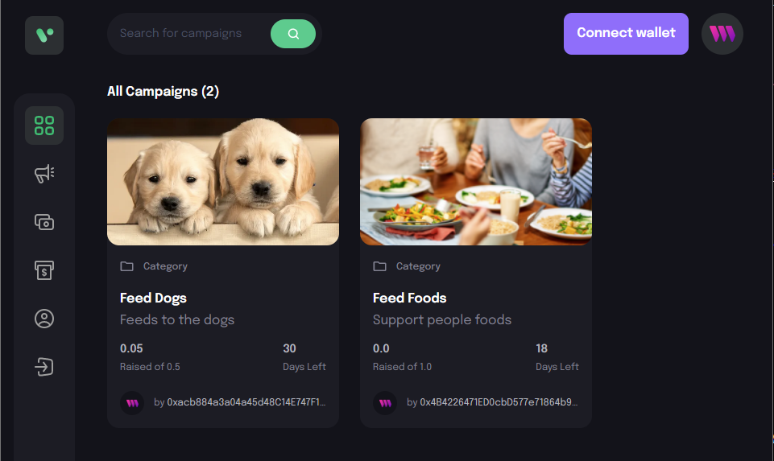

# Web3 Blockchain Crowdfunding Platform with Thirdweb

## Description

This is a code from the corresponding [**video tutorial**](https://youtu.be/BDCT6TYLYdI) in [JavaScript Mastery](https://www.youtube.com/@javascriptmastery) on Youtube.

## Screenshot



## How to run web application

Install [Metamask Extension](https://metamask.io/) on Google Chrome

```bash
npm install -g pnpm
cd ./client/
pnpm install
pnpm run dev
```

## How to deploy smart contract

Create file .env from file .env.template and update ***PRIVATE_KEY*** from Metamask wallet account private key

```bash
npm install -g pnpm
cd ./web3/
pnpm install
pnpm run deploy
```
